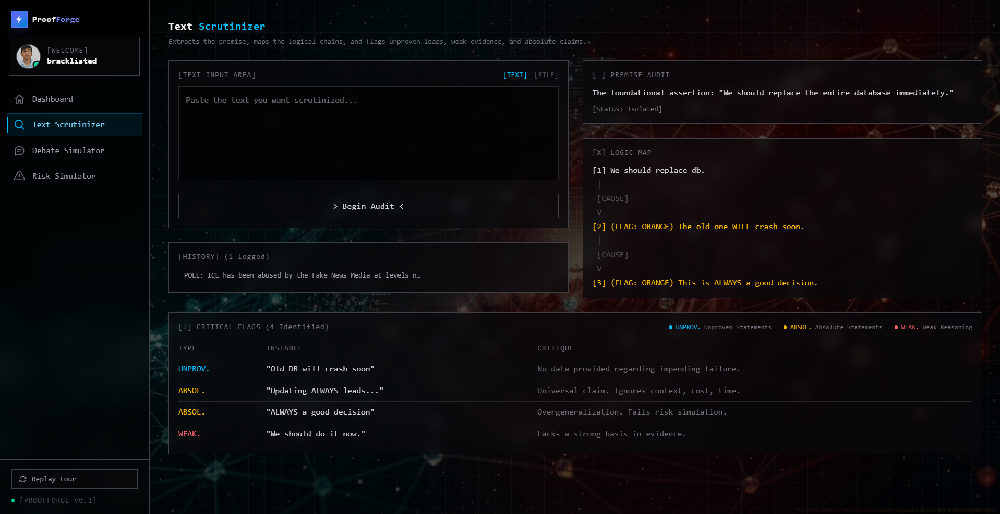
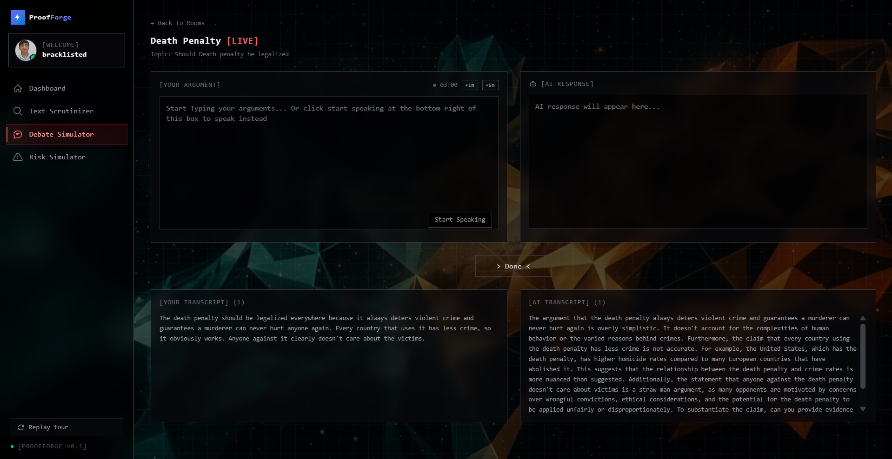
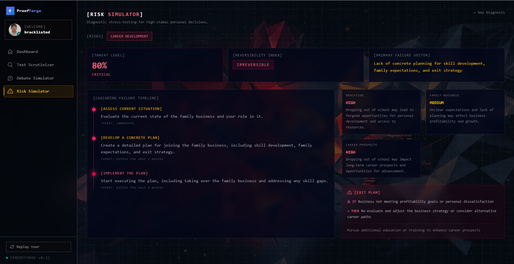
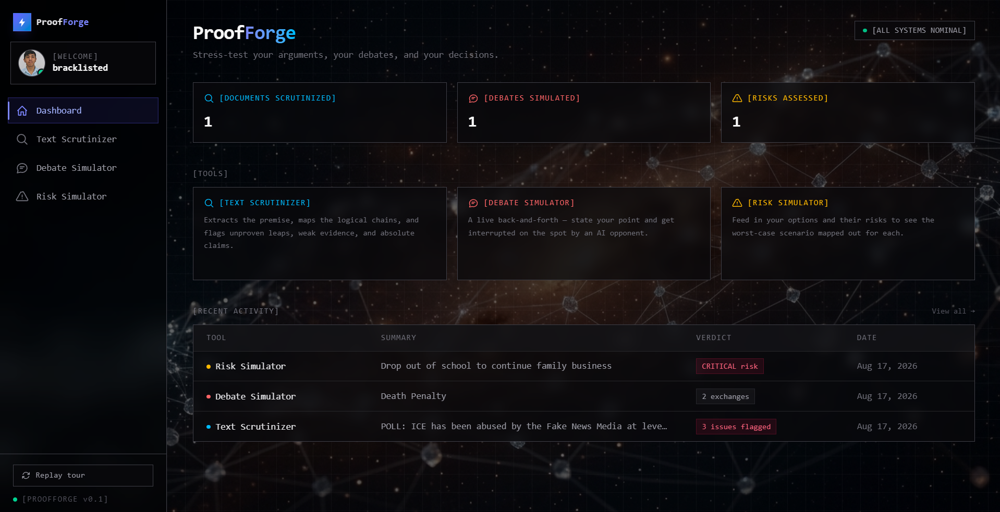

# ⚡ ProofForge

### Scrutinize text. Simulate debates. Calculate risk. Don't get blindsided.

**ProofForge is an adversarial reasoning engine** — a truth-and-strategy toolkit built to stress-test your thinking *before reality does it for you*. Most tools give you passive advice. ProofForge fights back: it tears apart weak arguments claim by claim, interrupts you mid-debate with a live AI opponent that won't let a bad point slide, and simulates the full blast radius of your riskiest decisions before you make them.

<p align="left">
  
  
  
  
  
  
  
  
  
</p>

---

## 🔥 Why ProofForge

Bad decisions rarely fail loudly. They fail quietly — an unproven assumption nobody questioned, an argument nobody pressure-tested, a risk nobody quantified until it was too late. ProofForge exists to make that failure happen **on your screen, in seconds, before it happens in your life.**

Three tools. One mission: don't let a weak idea survive contact with reality unchallenged.

## 🧩 What's inside

### 🔎 Text Scrutinizer
Drop in any statement, article, or viral post. ProofForge extracts its core premise, maps the full chain of reasoning behind it (`CAUSE → EVIDENCE → INFERENCE → CONTRADICTION`), and flags every point where it breaks:

- **`UNPROV.`** — claims with zero supporting evidence
- **`ABSOL.`** — overgeneralizations and false dichotomies
- **`WEAK.`** — non-sequiturs and flimsy reasoning

Turns "this sounds true" into "here's exactly why it isn't."



### 🗣️ Debate Simulator
State your position — type it or speak it — and get cross-examined in real time by an AI opponent that doesn't let evasions or weak points slide. It's a sparring partner for your own arguments, so the first time they get pressure-tested isn't in front of someone who matters.



### ⚠️ Risk Simulator
Feed it a real decision. It cross-examines you with the questions you'd need to answer honestly before committing, then turns your answers into a full risk profile: a computed risk score and threat level, a cascading-failure timeline showing how it could unravel over time, a blast-radius map of everything it touches, and an exit plan with a concrete trigger and fallback — so you're never caught without a plan B.



### 📊 Dashboard
Everything scrutinized, debated, and assessed lands here — live counts, a recent-activity feed, and one click into any tool. New here? An interactive, step-by-step guided tour walks you through all three tools end-to-end with a real live example in each, auto-advancing only once each result actually comes back.




## 🛠️ How it's built

| Layer | Stack |
|---|---|
| **Frontend** | React 19 + TypeScript, Vite, Tailwind CSS v4, Framer Motion, React Router |
| **Auth** | Clerk (session-based auth + webhooks) |
| **Runtime** | Node.js |
| **Backend** | Express |
| **Database** | PostgreSQL + Drizzle ORM |
| **AI Inference** | Groq — `openai/gpt-oss-20b` |

### Architecture

```
┌──────────────────┐        ┌──────────────────┐        ┌──────────────────┐
│   React Frontend  │  ───▶  │  Express Backend  │  ───▶  │   Groq Inference  │
│  (Vite + Clerk)   │  ◀───  │   (REST + Auth)   │  ◀───  │  GPT OSS 20B      │
└──────────────────┘        └────────┬─────────┘        └──────────────────┘
                                      │
                                      ▼
                             ┌──────────────────┐
                             │    PostgreSQL     │
                             │  (users · scrutinize │
                             │  · debate · risks) │
                             └──────────────────┘
```

*(swap in the real architecture diagram at `docs/screenshots/architecture.png` if you want a visual over the ASCII one)*

## 🚀 Getting started

### Prerequisites
- Node.js 20+
- A PostgreSQL database (any provider — Neon, Supabase, Railway, local)
- A [Clerk](https://clerk.com) application (publishable + secret key)
- A [Groq](https://console.groq.com) API key

### 1. Clone and install

```bash
git clone <this-repo-url>
cd ProofForge

cd backend && npm install
cd ../frontend && npm install
```

### 2. Configure environment variables

**`backend/.env`**
```env
PORT=5000
DATABASE_URL=postgres://...
CLERK_PUBLISHABLE_KEY=pk_...
CLERK_SECRET_KEY=sk_...
CLERK_WEBHOOK_SIGNING_SECRET=whsec_...
GROQ_API_KEY=gsk_...
```

**`frontend/.env`**
```env
VITE_CLERK_PUBLISHABLE_KEY=pk_...
```

### 3. Run the database migrations

```bash
cd backend
npx drizzle-kit push
```

### 4. Start it up

```bash
# terminal 1 — backend
cd backend && npx tsx index.ts

# terminal 2 — frontend
cd frontend && npm run dev
```

Visit `http://localhost:5173`, sign up, and start forging.

## 🧠 The build

**The problem:** most "AI writing/decision tools" give you agreeable, hedge-everything output. Nothing pushes back. ProofForge is the opposite by design — every tool exists to actively find the hole in your thinking before someone else does.

**The stack:** a full-stack TypeScript app — React 19 on the frontend, Express + PostgreSQL on the backend, Clerk handling auth end-to-end, and Groq's `openai/gpt-oss-20b` doing the actual reasoning work across all three tools (structured JSON output for premise/logic extraction, live debate cross-examination, and multi-stage risk diagnostics).

**What was hard:** getting three genuinely different AI-driven UX patterns — a one-shot structured audit, a real-time conversational debate with speech input, and a multi-step diagnostic interview — to feel like one coherent product instead of three bolted-together demos. The guided product tour in particular had to react to *real* async state (actual API responses landing, not fake timers) without ever letting the UI get stuck mid-flow.

